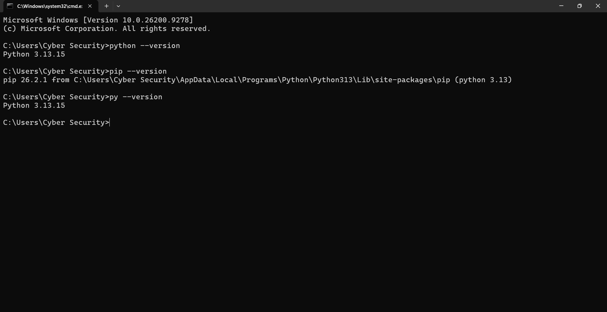
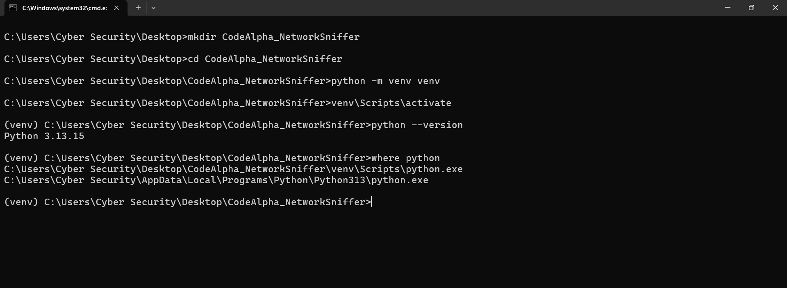
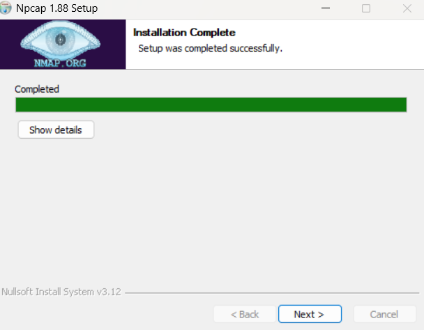
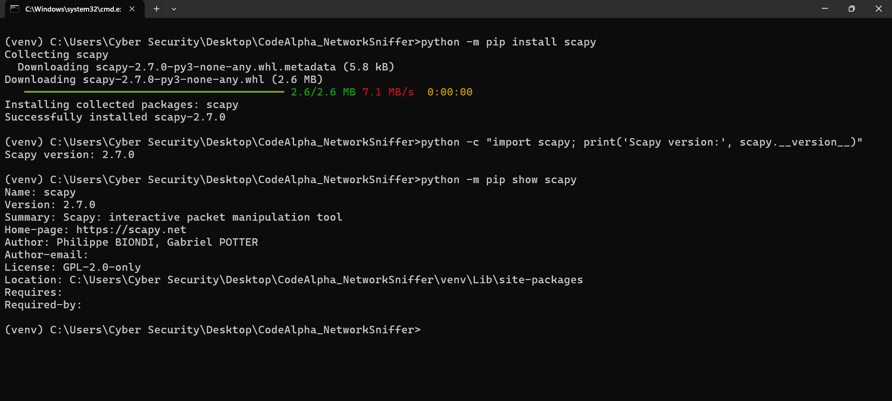
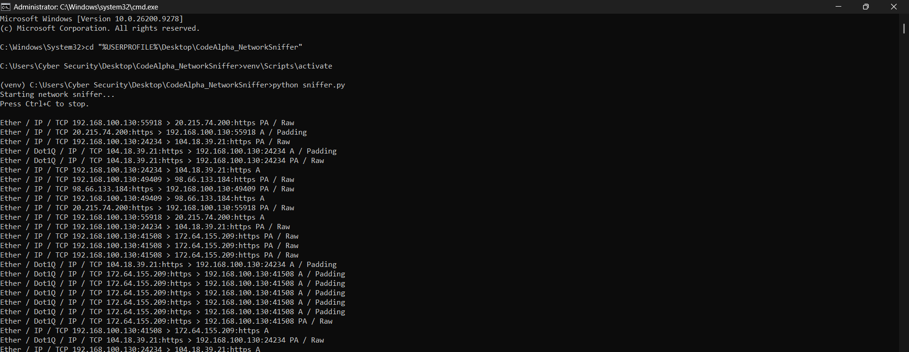
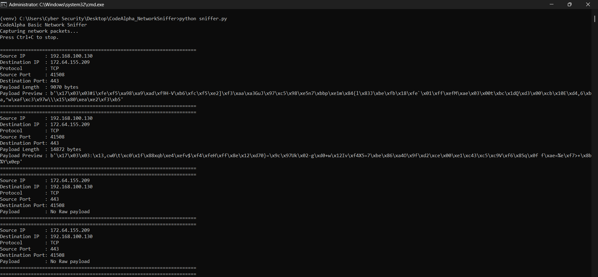
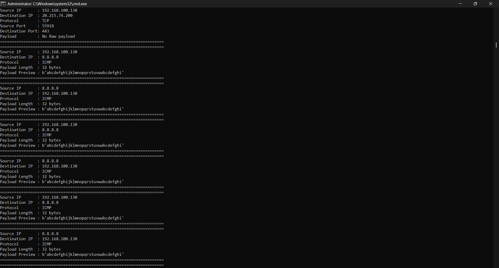
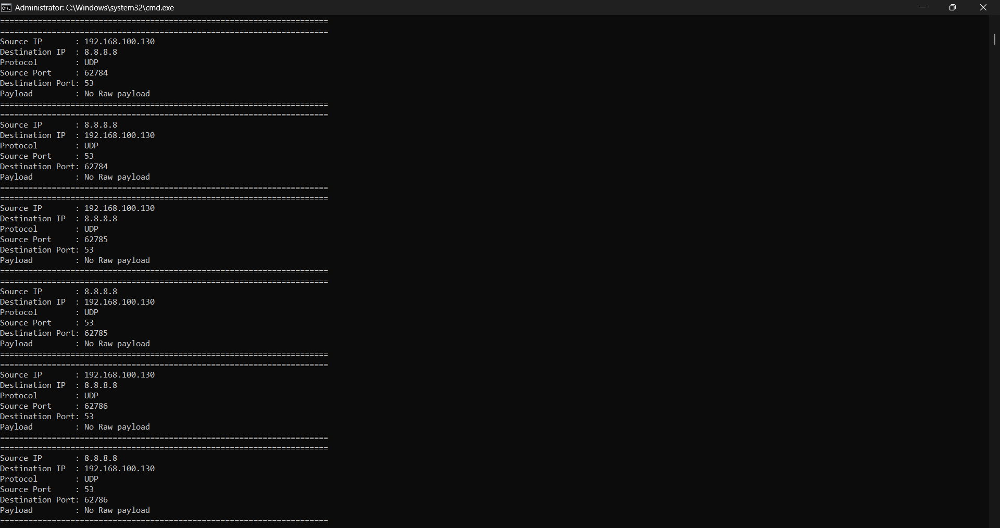
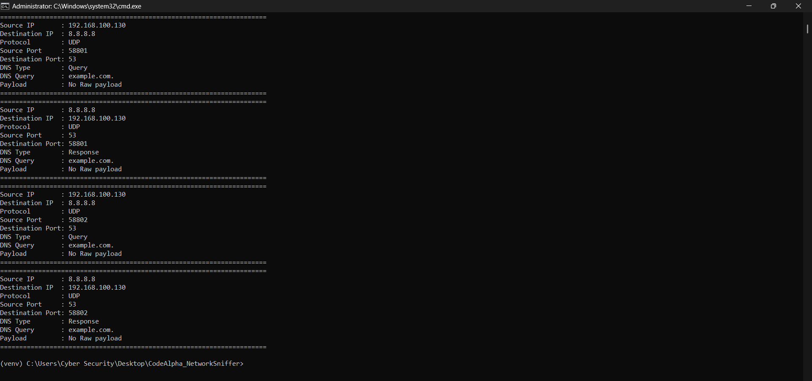
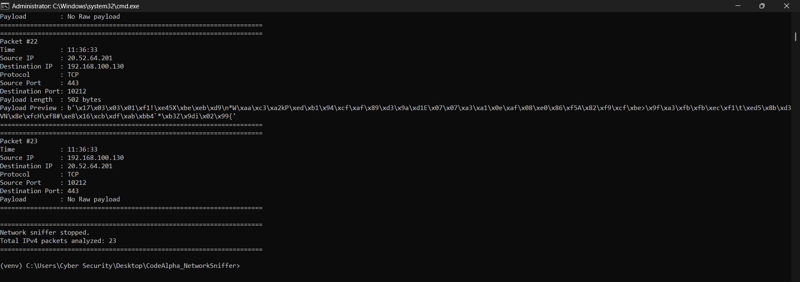

# CodeAlpha Basic Network Sniffer

A Python-based network packet sniffer developed as part of the **CodeAlpha Cyber Security Internship – Task 1**.

The application captures live IPv4 network traffic and analyzes useful packet information including source and destination IP addresses, protocols, ports, DNS queries, and payload data.

---

## Project Objective

The objective of this project is to gain practical experience with network packet capturing and protocol analysis.

The project demonstrates how network traffic can be inspected using Python, Scapy, and Npcap.

---

## Features

- Live IPv4 packet capturing
- Source IP detection
- Destination IP detection
- TCP packet analysis
- UDP packet analysis
- ICMP packet analysis
- Source and destination port detection
- DNS query and response analysis
- DNS domain name extraction
- Payload length detection
- Payload preview
- Packet numbering
- Capture timestamps
- Graceful shutdown using `Ctrl+C`
- Total analyzed packet counter

---

## Technologies Used

- Python 3.13.15
- Scapy 2.7.0
- Npcap 1.88
- Windows
- Command Prompt

---

## Project Structure

```text
CodeAlpha_NetworkSniffer/
│
├── sniffer.py
├── requirements.txt
├── .gitignore
├── README.md
└── screenshots/
```

---

## Installation

### 1. Clone the repository

```bash
git clone https://github.com/YOUR_USERNAME/CodeAlpha_NetworkSniffer.git
cd CodeAlpha_NetworkSniffer
```

### 2. Create a virtual environment

```bash
python -m venv venv
```

Activate it on Windows:

```bash
venv\Scripts\activate
```

### 3. Install dependencies

```bash
python -m pip install -r requirements.txt
```

### 4. Install Npcap

Npcap must be installed on Windows to allow Scapy to capture network packets.

---

## Usage

Open **Command Prompt as Administrator**.

Navigate to the project folder:

```bash
cd CodeAlpha_NetworkSniffer
```

Activate the virtual environment:

```bash
venv\Scripts\activate
```

Start the sniffer:

```bash
python sniffer.py
```

Stop the program using:

```text
Ctrl+C
```

---

## Example Output

```text
======================================================================
Packet #23
Time            : 11:36:33
Source IP       : 192.168.100.130
Destination IP  : 20.52.64.201
Protocol        : TCP
Source Port     : 10212
Destination Port: 443
Payload         : No Raw payload
======================================================================

======================================================================
Network sniffer stopped.
Total IPv4 packets analyzed: 23
======================================================================
```

---

## Protocol Testing

### TCP

TCP traffic was captured during normal web browsing.

The program displays:

- Source IP
- Destination IP
- Source port
- Destination port
- Payload information

### ICMP

ICMP traffic was generated with:

```bash
ping 8.8.8.8
```

The sniffer successfully detected ICMP request and response packets.

### UDP and DNS

DNS traffic was generated with:

```bash
nslookup example.com 8.8.8.8
```

Example DNS result:

```text
Source IP       : 192.168.100.130
Destination IP  : 8.8.8.8
Protocol        : UDP
Destination Port: 53
DNS Type        : Query
DNS Query       : example.com.
```

The program also detected the corresponding DNS response.

---

## Screenshots

### Python Installation



### Virtual Environment Setup



### Npcap Installation



### Scapy Installation



### Basic Packet Capture



### TCP Packet Analysis



### ICMP Packet Analysis



### UDP and DNS Port Analysis



### DNS Query and Response Analysis



### Final Execution



---

## How It Works

The application uses Scapy's `sniff()` function to capture live packets.

For each IPv4 packet:

- TCP packets are analyzed for TCP ports.
- UDP packets are analyzed for UDP ports.
- ICMP packets are identified separately.
- DNS packets are inspected for queries and responses.
- Raw payload data is displayed when available.
- Only the first 80 bytes of raw payload data are shown to keep the terminal output readable.

---

## HTTPS Traffic

HTTPS normally uses TCP port `443`.

Because HTTPS application data is encrypted, captured payloads can appear as binary data such as:

```text
b'\x17\x03\x03...'
```

This is expected behavior. The network packet can be captured while the protected application data remains encrypted.

---

## Ethical Use

This project is intended strictly for educational and authorized cybersecurity purposes.

Packet capturing should only be performed on:

- Your own computer
- Your own network
- Networks where you have explicit authorization

Do not use this project to intercept traffic without permission.

---

## Learning Outcomes

Through this project, I gained practical experience with:

- Network packet capturing
- IPv4 traffic analysis
- TCP, UDP, and ICMP
- DNS traffic
- Network ports
- Packet payloads
- Python networking
- Scapy
- Npcap

---

## Internship

This project was developed for the **CodeAlpha Cyber Security Internship**.

**Task 1: Basic Network Sniffer**

---

## Author

Developed as part of the CodeAlpha Cyber Security Internship Program.